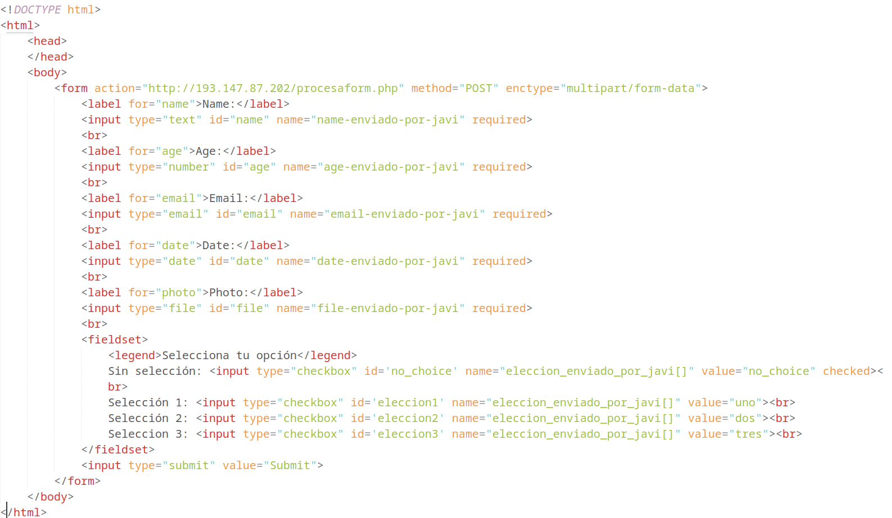

# IU_24-25
Repositorio Código utilizado en clase práctica de IU

# Introducción HTML (formularios)

Creación de un formulario base utilizando la literatura proporcionada.

Un ejemplo como el siguiente:

Se envía con el atributo action a un servicio que devuelve el nombre de las variables que le llegan desde el formulario, junto con el tipo y tamaño y su valor.

Ejemplo de respuesta del formulario una vez que se ha rellenado con datos todos los campos y se ha realizado el submit.

# Introducción HTML (estructuración html)

# Referencias

HTML Semántico : https://es.semrush.com/blog/html-semantico/

